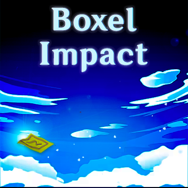

# Boxel Impact

*What if Minecraft was your favorite new gacha game?*

*...well, now it is!*

---
## What is Boxel Impact?

Boxel Impact is a Minecraft (version 1.19.4) mod that adds a new dimension of gameplay to the game: a gacha-like item system. You can collect resources, weapons, and more, all through the power of gacha!

It is written in Java, and is built on top of the [Minecraft Forge](https://files.minecraftforge.net/) modding framework.

This project also utilizes the following libraries:

- [Apache Commons Math 3.6.1 (Apache License 2.0)](https://commons.apache.org/proper/commons-math/)

## How does it work?

Boxel Impact adds a gacha-influenced system to Minecraft with configurable 'banners'. Each banner has a set of items that can be obtained from it, and each item has a set of rarities that it can be obtained at. Each banner also has a set of 'pity' values, which are used to determine the rarity of the next item you obtain from the banner.

...aka, just like Genshin Impact. But in Minecraft.

Because no-one asked for this.

## Proposed Feature List

- [x] Modular code to allow modders to easily add customized functionality
- [ ] Basic gacha system (with multiple tiered currencies) with a single banner and multiple rarities
- [ ] Basic config system for gacha items
- [ ] Multiple banners with a per-banner config system
- [ ] Custom art support for banners via resource packs
- [ ] Rotating banners within tiers
- [ ] Banner pity system
- [ ] Currency obtained from pulling banners and store (configurable) utilizing that currency
- [ ] JavaDocs for modders to reference

*...additional features may be added in the future...*

## Licenses

This project contains two licenses, mutually exclusive to their respective parts of the project:

- This mod's code is licensed under the **GNU General Public License Version 3**. See `LICENSE` for more information.

- This mod's resources (*all content located in `src/main/resources`*) is licensed under the **Creative Commons Attribution-ShareAlike 4.0 International License**. See `LICENSE_RESOURCES` for more information.

Individual libraries used by this mod are licensed under their respective licenses. See the relevant licenses for more information.